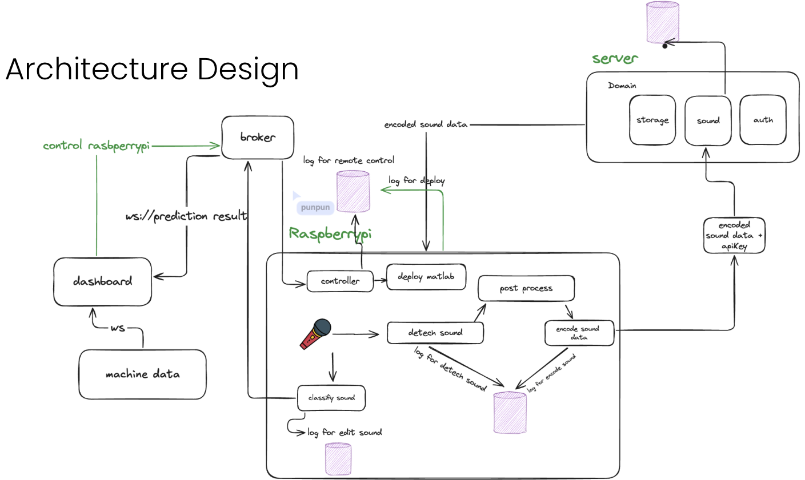

# Audio Processing and Prediction System

This repository is a real-time fraud detecion system implemented in **C**, deployed **raspberry pi 5**. The system is designed to extract features from audio signals, make real-time fraud predictions using a machine learning model, and communicate results via MQTT. It also includes support for sending data to a remote server using cURL.

## Features

-   **Audio Feature Extraction**: Utilizes MATLAB-generated C code to extract features from audio signals.
-   **Real-Time Prediction**: Implements a machine learning model for real-time audio classification.
-   **MQTT Communication**: Publishes and subscribes to MQTT topics for real-time data exchange.
-   **cURL Integration**: Sends data to a remote server using cURL.
-   **Multithreading**: Efficiently handles multiple tasks using pthreads.
-   **Logging**: Logs system events to a file for debugging and monitoring for all system.
-   **Control Commands**: Accepts commands to control the system via MQTT.

## System Architetucre Design



## Directory Structure

```
.
|-- config
|   `-- config.json
|-- include
|   |-- handlers
|   |   |-- command_handler.h
|   |   |-- controller_handler.h
|   |   |-- db_handler.h
|   |   `-- mqtt_handler.h
|   |-- services
|   |   |-- model_service.h
|   |   `-- sound_service.h
|   `-- utils
|       |-- config.h
|       `-- logger.h
|-- main
|   `-- service_main.c
|-- rename.py
|-- service_main
`-- src
    |-- handlers
    |   |-- command_handler.c
    |   |-- controller_handler.c
    |   |-- db_handler.c
    |   |-- mqtt_handler.c
    |   `-- queue_handler.c
    |-- services
    |   |-- model_service.c
    |   `-- sound_service.c
    |-- utils
    |   |-- config.c
    |   `-- logger.c
    |-- predict
    |   |-- predictRealTime.c
    |   |-- predictRealTime.h
    `-- extract
        |-- extractFeatures.c
        |-- extractFeatures.h
```

## Getting Started

### Prerequisites

Install the required libraries by running the following command:

```sh
sudo apt-get update
sudo apt-get install -y \
 libpaho-mqtt-dev \
 libcurl4-openssl-dev \
 libssl-dev \
 libasound2-dev \
 ffmpeg \
 build-essential \
 cmake \
```

### Building the Project

To build the project, run the following command:

```sh
make
```

### Running the Service

To run the service, execute the following command:

```sh
./service_main
```
